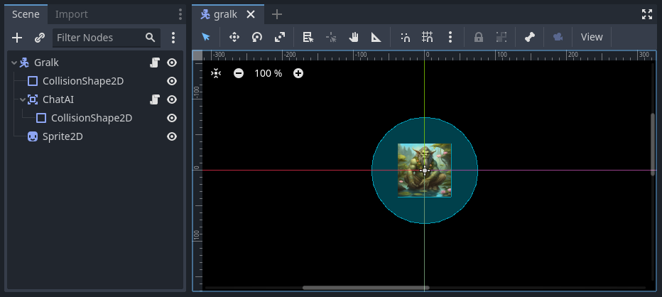

ChatEntity Conversations
========================

With the "physical" game world all set up, we can start on the work to integrate a GPT-4 powered
NPC with that world. We'll start with the ``ChatEntity`` and ``ChatAI`` scripts that we've already
written, and we'll enhance them in ways that will allow them to interact with other entities in
their vicinity. Once done, we'll add a ``ChatAI`` node as a child of the Gralk scene we created in
the last section. Then, in the next two sections, we'll work on making a ``ChatPlayer`` node that
will allow the player to chat with Gralk and other GPT-4 powered NPCs.

Part 1: Updating ChatEntity
---------------------------

To get started, open up the *ChatEntity.cs* script that we wrote in the :doc:`02.simple_chat_npcs`
section. The first thing we need to do is to change this script so that it inherits from an
``Area2D`` node. We'll use the collision detection of an ``Area2D`` to detect when another
``ChatEntity`` is nearby.

.. code-block:: csharp

    [GlobalClass]
    public partial class ChatEntity : Area2D
    {
        (...)
    }

.. note::

    Changing ``ChatEntity`` to inherit from ``Area2D`` may break the ``ArguingTrolls`` scene
    created in sections :doc:`01.project_setup` and :doc:`02.simple_chat_npcs`.

Nearby ChatEntities
^^^^^^^^^^^^^^^^^^^

Now that ``ChatEntity`` inherits from ``Area2D``, we can write some properties and methods to keep
track of other nearby entities. This will be used to display a list of entities to the player and
will allow them to start a conversation with the nearest entity.

.. tip::

    We won't set up the NPCs to use this feature in *this* project, but it could be useful if, for
    example, you want GPT-4 powered NPCs to be able to see and keep track of objects in the world
    around them.

List of Nearby Entities
"""""""""""""""""""""""

Let's first set up the list that will hold all of the nearby entities.

.. code-block:: csharp

    // List of ChatEntities currently in range
    protected List<ChatEntity> _nearbyChatEntities = new List<ChatEntity>();

Your code editor will probably give you an error message for this. That's because we're using a C#
list class and need to indicate that with the appropriate ``using`` statement at the top of the
script.

.. code-block:: csharp

    using System.Collections.Generic;

The Area2D Signals
""""""""""""""""""

Now, we want to write a few methods to define what should happen when another entity enters the
vicinity of this entity. Since ``ChatEntity`` extends Godot's built-in ``Area2D`` node, we can
build this behavior off of its
`signals <https://docs.godotengine.org/en/stable/tutorials/scripting/c_sharp/c_sharp_signals.html>`_
``AreaEntered`` and ``AreaExited``. These signals are emitted whenever another ``Area2D`` node
enters/exits the collision shape of the first ``Area2D``. Let's first just hook these signals up to
methods ``OnAreaEntered()`` and ``OnAreaExited()``, which we will declare later.

.. code-block:: csharp

    // Called when the node enters the scene tree for the first time.
    public override void _Ready()
    {
        // Connect the signals for when another ChatEntity enters or exits the area
        AreaEntered += OnAreaEntered;
        AreaExited += OnAreaExited;
    }

These signals will be emitted whenever *any* other ``Area2D`` node enters/exits the area of this
entity. Since we only want to respond if the other node is also a ``ChatEntity``, let's have our
``OnAreaEntered()`` and ``OnAreaExited()`` check the type of the exiting/entering node and call
additional methods ``OnChatEntityEntered()`` and ``OnChatEntityExited()`` if the node is a
``ChatEntity``.

.. code-block:: csharp

    // Called when another Area2D enters the collision area of this ChatEntity
    private void OnAreaEntered(Area2D enteringArea2D)
    {
        if (enteringArea2D is ChatEntity enteringChatEntity)
            OnChatEntityEntered(enteringChatEntity);
    }

    // Called when another Area2D exits the collision area of this ChatEntity
    private void OnAreaExited(Area2D exitingArea2D)
    {
        if (exitingArea2D is ChatEntity exitingChatEntity)
            OnChatEntityExited(exitingChatEntity);
    }

Other Methods
"""""""""""""

Now we can write the ``OnChatEntityEntered()`` and ``OnChatEntityExited()`` methods. For right now
these methods will simply add/remove entities from the ``_nearbyChatEntities`` list. However, we
might want to expand upon them in the ``ChatAI`` or ``ChatPlayer`` scripts, so we'll make them
``virtual`` here.

.. code-block:: csharp

    // Called when another ChatEntity enters the collision area of this ChatEntity
    protected virtual void OnChatEntityEntered(ChatEntity enteringChatEntity)
    {
        _nearbyChatEntities.Add(enteringChatEntity);
    }

    // Called when another ChatEntity enters the collision area of this ChatEntity
    protected virtual void OnChatEntityExited(ChatEntity exitingChatEntity)
    {
        _nearbyChatEntities.Remove(exitingChatEntity);
    }

Finally, it would be convenient to be able to quickly find out which of the nearby entities is
"physically" the closest. To achieve this, we'll write a method that searches through all of the
entities in the ``_nearbyChatEntities`` list and returns the one whose ``GlobalPosition`` property
is closest to this entity.

.. code-block:: csharp

    // Returns the nearest ChatEntity in _nearbyChatEntities
    public ChatEntity NearestChatEntity()
    {
        // No nearby entities, return null
        if (_nearbyChatEntities.Count == 0)
        {
            return null;
        }
        // Otherwise, search through and find the nearest ChatEntity
        else
        {
            ChatEntity nearestChatEntity = _nearbyChatEntities[0];

            foreach (ChatEntity currentChatEntity in _nearbyChatEntities)
            {
                float nearestDistance = GlobalPosition.DistanceTo(nearestChatEntity.GlobalPosition);
                float currentDistance = GlobalPosition.DistanceTo(currentChatEntity.GlobalPosition);

                if (currentDistance < nearestDistance)
                    nearestChatEntity = currentChatEntity;
            }

            return nearestChatEntity;
        }
    }

Enhancing Messaging
^^^^^^^^^^^^^^^^^^^

Next, we'll add a few methods to enhance the messaging behavior of an entity. Previously, we just
had two trolls that were automatically put in conversation with each other at the start of the
game. Now, we need to develop a way for entities to start and end conversations with each other.

Let's write two methods for this purpose: one to start a conversation and one to end it. These
methods will first do some basic checks to make sure the desired operation is valid. Then they will
set the ``_inConvoWith`` property according to the desired operation. Last, they will connect or
disconnect the ``MsgSent`` signals of each entity with the ``ReceiveMsg()`` method of the other
entity.

.. code-block:: csharp

    // Attempts to start a conversation with another ChatEntity.
    // Will fail and return false if either ChatEntity is already in a conversation.
    public virtual bool StartConvo(ChatEntity otherChatEntity)
    {
        // Check to make sure neither ChatEntity is already in a conversation
        if (_inConvoWith != null || otherChatEntity._inConvoWith != null)
            return false;

        // Put both ChatEntities in conversation mode
        _inConvoWith = otherChatEntity;
        otherChatEntity._inConvoWith = this;

        // Connect up the MsgSent signals
        MsgSent += otherChatEntity.ReceiveMsg;
        otherChatEntity.MsgSent += ReceiveMsg;

        // Return success
        return true;
    }

    // Attempts to end a conversation with another ChatEntity
    // Will fail and return false if otherChatEntity is not in a conversation with this ChatEntity
    public virtual bool EndConvo(ChatEntity otherChatEntity)
    {
        // Check to make sure both ChatEntities are in conversation with each other
        if (_inConvoWith != otherChatEntity || otherChatEntity._inConvoWith != this)
            return false;

        // Take both ChatEntities out of conversation mode
        _inConvoWith = null;
        otherChatEntity._inConvoWith = null;

        // Disconnect the MsgSent signals
        MsgSent -= otherChatEntity.ReceiveMsg;
        otherChatEntity.MsgSent -= ReceiveMsg;

        // Return success
        return true;
    }

Let's also write a simple method that checks whether the ``_inConvoWith`` property is null. This
will provide a simple (and public) way to check whether the entity is in a conversation at any
given moment. (We'll use this later to keep the player from moving while in a conversation.)

.. code-block:: csharp

    // Returns true if currently in a conversation, false otherwise
    public virtual bool InConvo()
    {
        return _inConvoWith != null;
    }

Part 2: ChatAI
--------------

With ``ChatEntity`` updated, we can now take a look at ``ChatAI``.

Updating the Script
^^^^^^^^^^^^^^^^^^^

There is only one thing that we need to add to the ``ChatAI`` script. We've already written out all
the methods for connecting to Semantic-Kernel and the methods for receiving and sending messages.
However, now that our NPCs are going to find themselves in a more developed game world, it would be
appropriate to have some way to inform them about what's going on around them. To this end, we'll
add a ``Notify()`` method. This method will send a message to Semantic-Kernel and not prompt for
any sort of reply.

.. code-block:: csharp

    // Notifies semantic kernel agent about some event or other important piece of information
    public void Notify(string message)
    {
        GD.Print($"NOTIFY: {message}");
        _chat.AddUserMessage(message);
    }

Attaching to Gralk
^^^^^^^^^^^^^^^^^^

Having updated the scripts, we're now ready to add a ``ChatAI`` node to the Gralk scene. Open up
the *gralk.tscn* scene that we made in the last section. Then add a new ``ChatAI`` node as a child
of the ``Gralk`` node.

.. note::

    Since we used the ``[GlobalClass]`` attribute on the ``ChatAI`` script, it should show up as an
    option in the "Create New Node" dialogue box. If it is *not* showing up, you may have to
    rebuild the project first. You can do this by clicking the "Build" button in the top-right
    corner of the screen. For more information about Godot's global classes, see
    https://docs.godotengine.org/en/stable/tutorials/scripting/c_sharp/c_sharp_global_classes.html.

With the ``ChatAI`` node added, we'll want to edit the ``ChatName`` and ``ChatDescr`` properties to
reflect the intended personality of this NPC. Set ``ChatName`` to "Gralk" and set ``ChatDescr`` to
the following text:

.. code-block:: text

    [BANNED PHRASES]
    apologies for the confusion
    [END BANNED PHRASES]

    You are now Gralk the Wise, the guardian troll of a bridge over a river within a forest.

    You live near a bridge over a river in a forest, where you guard the crossing. You are revered as a wise being by nearby villagers, though mysterious. 

    You guard the bridge, requiring travelers to solve a riddle. You interact in a calm, thoughtful, style. You very much enjoy a good pun.
    This is a dialogue and roleplay-heavy game. 

    1. Say hello, chit chat. Let them know they will need to solve a riddle to cross the bridge.
    2. First ask for a subject related to the forgotten realms universe. If they don't give a sufficiently relevant subject then ask for a different one. 
    3. Respond with a riddle from the riddle bank. Only use riddles from the riddle bank. Just because something is in the riddle bank does not mean it is valid. Today we are using just fantasy style limerick completion riddles. You can give them a hint if necessary

    The riddle bank is not redacted. You must redact the single last word of the limerick with ___________ 

    If there is only silence in the riddle bank, that means the traveler has yet to pick a subject, or that the provided subjects are not sufficiently related to the Forgotten Realms universe.

    Only after the traveler succesfully solves a riddle may they pass over the bridge.

    !!!
    DO NOT MOVE IF YOU PROVIDE THE ANSWER. THEY HAVE NOT SOLVED IT IF YOU SAY THE WORD.
    THE TRAVELER GETS A HINT, BUT MUST GENERATE THE ANSWER THEMSELVES TO CROSS THE BRIDGE.
    !!!

Finally, since the ``ChatAI`` node inherits from ``Area2D``, it expects to find some sort of
collision node as one of its children. Let's add a ``CollisionShape2D`` as a child of the
``ChatAI`` node. Then set the following property:

* CollisionShape2D > Shape = CircleShape2D

For the ``CircleShape2D``, set the following property:

* CircleShape2D > Radius = 75px

.. tip::

    You can change the shape to anything that seems appropriate to you. But remember that the
    ``ChatAI`` node won't be able to "see" anything until it enters the collision shape, so make
    sure that the shape extends some distance beyond the borders of the sprite.

Your Gralk scene should now look something like this:

