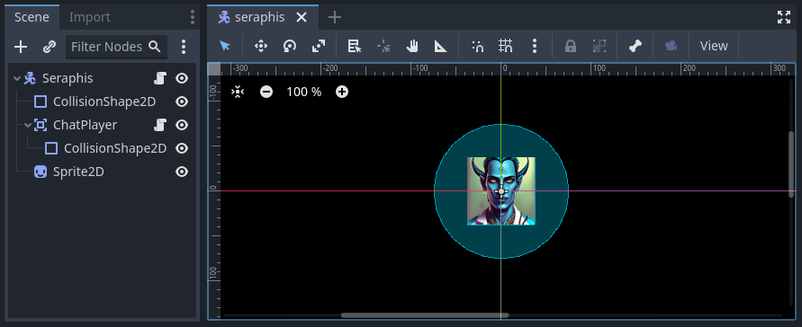

The Player
==========

In this section we will create the ``ChatPlayer`` node, which will be another extension of
``ChatEntity``. This node will be attached to the player character and will allow it to interact
with the ChatAI nodes. It will be controlled by keyboard and UI input from the player. By the end
of this section, we should be able to see when the player gets close enough to "see" Gralk, when
they start and end conversations, and when they send and respond to messages.

.. note::

    Since we don't have the UI set up yet, all of this will be shown in the output terminal for now
    and messages will need to be coded directly in our scripts. After we create the UI in the next
    section, everything will be visible on the game screen.

Part 1: Writing the ChatPlayer Script
-------------------------------------

To start, we'll write the ``ChatPlayer`` script, which will extend ``ChatEntity`` and will define
how players can interact with AI-powered NPCs. Right click the filesystem dock and create a new
script. Make sure the language is set to C# and it inherits from ``ChatEntity``. Save the script as
*ChatPlayer.cs*.
Once the script is created, open it up and add the ``[GlobalClass]`` attribute above the class
declaration.

.. code-block:: csharp

    using Godot;

    [GlobalClass]
    public partial class ChatPlayer : ChatEntity
    {
        (...)
    }

.. warning::

    Godot may automatically add a ``_Ready()`` method to the script. If it does,
    delete it. An empty ``_Ready()`` method  will prevent the base ``_Ready()``
    method from being called.

Properties
^^^^^^^^^^

With the ``ChatPlayer`` class set up, we can add a few properties to it. First, add a
``_controlHint`` property. This will hold a message that will be displayed to the player to
indicate what kinds of inputs and actions they can do at any given moment.

.. code-block:: csharp

    // The current control hint
    private string _controlHint;

Next, add a few signals. We'll set up these signals to be emitted whenever ``ChatPlayer`` does
anything that we might want the UI to be aware of.

.. code-block:: csharp

    // Signals for connecting to the UI
    [Signal]
    public delegate void ControlHintUpdatedEventHandler(string controlHint);
    [Signal]
    public delegate void ChatEntityAddedEventHandler(ChatEntity chatEntity);
    [Signal]
    public delegate void ChatEntityRemovedEventHandler(ChatEntity chatEntity);
    [Signal]
    public delegate void ConvoStartedEventHandler();
    [Signal]
    public delegate void ConvoEndedEventHandler();
    [Signal]
    public delegate void MsgAddedEventHandler(ChatEntity sender, string msg);

.. note::

    Our use of signals here follows the "call down, signal up" convention. Although the UI will not
    technically be the parent or ancestor of ``ChatPlayer``, it will exist somewhat higher up in
    the scene tree. Additionally, it would never really make sense to use the UI where there is
    no ``ChatPlayer`` node, but it could make sense to use the ``ChatPlayer`` node in a situation
    where there is no UI. Using signals here makes it so that the UI doesn't have to exist in order
    for ``ChatPlayer`` to function properly.

Control Hint Methods
^^^^^^^^^^^^^^^^^^^^

The first method to add in the ``ChatPlayer`` script is the ``_Process()`` method, which we'll use
to keep the control hint updated. Each frame, we'll evaluate the current game situation and
determine whether we need to update the control hint. If we do update it, we'll also emit a signal
indicating that.

.. code-block:: csharp

    // Called every frame. 'delta' is the elapsed time since the previous frame.
    public override void _Process(double delta)
    {
        // Figure out what the control hint should be for this frame
        string newControlHint = "Use the arrow keys to move";
        if (InConvo())
        {
            newControlHint = "Press ESC to end the conversation";
        }
        else
        {
            ChatEntity nearestChatEntity = NearestChatEntity();
            if (nearestChatEntity != null)
                newControlHint = $"Press SHIFT to talk with {nearestChatEntity.ChatName}";
        }
        // If the control hint should be different, update it
        if (newControlHint != _controlHint)
        {
            _controlHint = newControlHint;
            EmitSignal("ControlHintUpdated", _controlHint);
            GD.Print($"Control Hint: {_controlHint}");
        }
    }

.. note::

    We've added a ``GD.Print()`` statement to this method so that we can see in the output terminal
    when the control hint changes. The other methods we'll write for ``ChatPlayer`` will have
    similar print statements. This is a temporary solution until we complete the UI in the next
    section.

Conversation Methods
^^^^^^^^^^^^^^^^^^^^

The next few methods we'll write will control starting and ending conversations. We want the player
to be able to trigger these methods using keyboard input, so first we need to create two new
actions in the project's input map: ``start_convo`` and ``end_convo``. Let's add the SHIFT key as
an input event for ``start_convo`` and the ESC key as an input event for ``end_convo``.

With that set up, we can override the built-in ``_Input()`` method to listen for these actions and
call the corresponding method, either ``StartConvo()`` or ``EndConvo()``. We'll also use
``InConvo()`` to check and make sure the player's input is valid for the current situation.

.. code-block:: csharp

    // Listen for input to start/end a conversation
    public override void _Input(InputEvent @event)
    {
        // If input is "start_convo", try to start conversation with the closest entity
        if (@event.IsActionPressed("start_convo") && !InConvo())
        {
            ChatEntity nearestChatEntity = NearestChatEntity();
            if (nearestChatEntity != null)
                StartConvo(nearestChatEntity);
        }
        // If input is "end_convo", try to end conversation
        else if (@event.IsActionPressed("end_convo") && InConvo())
        {
            EndConvo(_inConvoWith);
        }
    }

Now we can write ``StartConvo()`` and ``EndConvo()`` for starting and ending conversations. These
will be overrides of the ``ChatEntity`` methods. We'll first call the base methods. Then, assuming
everything was set up correctly, we'll notify the NPC that we started or ended a conversation with
them and will emit the corresponding signal.

.. code-block:: csharp

    // Attempts to start a conversation with another ChatEntity.
    // Will fail and return false if otherChatEntity is already in a conversation.
    public override bool StartConvo(ChatEntity otherChatEntity)
    {
        // Do the basic stuff
        if (!base.StartConvo(otherChatEntity))
            return false;

        // If otherChatEntity is a ChatAI, notify it of the start of the conversation
        if (otherChatEntity is ChatAI otherChatAI)
            otherChatAI.Notify($"{ChatName} has started a conversation with you.");

        // Indicate that a conversation was started
        EmitSignal(SignalName.ConvoStarted);
        GD.Print($"Conversations: Started a conversation with {otherChatEntity.ChatName}");

        // Return success
        return true;
    }

    // Attempts to end a conversation with another ChatEntity
    // Will fail and return false if otherChatEntity is not in a conversation with this ChatEntity
    public override bool EndConvo(ChatEntity otherChatEntity)
    {
        // Do the basic stuff
        if (!base.EndConvo(otherChatEntity))
            return false;

        // If otherChatEntity is a ChatAI, notify it of the end of the conversation
        if (otherChatEntity is ChatAI otherChatAI)
            otherChatAI.Notify($"{ChatName} has ended their conversation with you.");

        // Indicate that a conversation was ended
        EmitSignal(SignalName.ConvoEnded);
        GD.Print($"Conversations: Ended a conversation with {otherChatEntity.ChatName}");

        // Return success
        return true;
    }

Messaging Methods
^^^^^^^^^^^^^^^^^

Next, we'll override the ``SendMsg()`` and ``ReceiveMsg()`` methods from ``ChatEntity``. Besides
calling the base method in ``SendMsg()`` (which does the work of sending the message to
the entity that we're currently in a conversation with), we'll also emit a signal that can be
picked up by the UI.

.. code-block:: csharp

    // A useful shorthand for sending a message
    public override void SendMsg(string msg)
    {
        // Send the message to ChatEntity _inConvoWith
        base.SendMsg(msg);

        // Emit a signal that there is a new message (for UI)
        EmitSignal(SignalName.MsgAdded, this, msg);
    }

    // Called when ChatEntity _inConvoWith emits a MsgSent signal
    public override void ReceiveMsg(string msg)
    {
        // Emit a signal that there is a new message (for UI)
        EmitSignal(SignalName.MsgAdded, _inConvoWith, msg);
    }

.. note::

    The ``SendMsg()`` method should already have a print statement in its base definition in the
    ``ChatEntity`` class. Because of this, we haven't added any print statements here.

Nearby ChatEntity Methods
^^^^^^^^^^^^^^^^^^^^^^^^^

Finally, the last two methods that we'll write for ``ChatPlayer`` will be ``OnChatEntityEntered()``
and ``OnChatEntityExited()``. These are also overrides of ``ChatEntity`` methods. The base
methods simply keep track of nearby entities as they come into or move out of the player's
vicinity. Besides calling these base methods, we'll also emit a signal that the UI can pick up.

.. code-block:: csharp

    // Called when another ChatEntity enters the collision area of this ChatEntity
    protected override void OnChatEntityEntered(ChatEntity enteringChatEntity)
    {
        base.OnChatEntityEntered(enteringChatEntity);
        EmitSignal("ChatEntityAdded", enteringChatEntity);
        GD.Print($"Nearby Entities: {enteringChatEntity.ChatName} has entered your vicinity");
    }

    // Called when another ChatEntity exits the collision area of this ChatEntity
    protected override void OnChatEntityExited(ChatEntity exitingChatEntity)
    {
        base.OnChatEntityExited(exitingChatEntity);
        EmitSignal("ChatEntityRemoved", exitingChatEntity);
        GD.Print($"Nearby Entities: {exitingChatEntity.ChatName} has exited your vicinity");
    }

Part 2: Using the ChatPlayer Node
---------------------------------

Having written the ``ChatPlayer`` script, we're now ready to add a ``ChatPlayer`` node to the
Seraphis scene. Doing so will enable the player to interact with Gralk and other ``ChatAI`` NPCs.

Attaching to Seraphis
^^^^^^^^^^^^^^^^^^^^^

First, open up the *seraphis.tscn* scene that we made previously. Add a new ``ChatPlayer`` node as
a child of the ``Seraphis`` node.

.. note::

    Since we used the ``[GlobalClass]`` attribute on the ``ChatPlayer`` script, it should show up
    as an option in the "Create New Node" dialogue box. If it is *not* showing up, you may have to
    rebuild the project first. You can do this by clicking the "Build" button in the top-right
    corner of the screen. For more information about Godot's global classes, see
    https://docs.godotengine.org/en/stable/tutorials/scripting/c_sharp/c_sharp_global_classes.html.

On the ``ChatPlayer`` node, set the ``ChatName`` property to "Seraphis". In this project, setting
``ChatDescr`` is not necessary for player characters. Feel free to leave it blank or set it to any
appropriate description.

Since the ``ChatPlayer`` node inherits from ``Area2D``, it expects to find some sort of collision
node as one of its children. Let's add a ``CollisionShape2D`` as a child of the ``ChatPlayer``
node. Then set the following property:

* CollisionShape2D > Shape = CircleShape2D

For the ``CircleShape2D``, set the following property:

* CircleShape2D > Radius = 75px

.. tip::

    You can change the shape to anything that seems appropriate to you. But remember that the
    ``ChatPlayer`` node won't be able to "see" anything until it enters the collision shape, so
    make sure that the shape extends some distance beyond the borders of the sprite.

Your Seraphis scene should now look something like this:

Updating Seraphis Script
^^^^^^^^^^^^^^^^^^^^^^^^

Finally, we also need to make a small change the *Seraphis.cs* script. Right now, it will be
possible for the player to move around while in a conversation. This might be confusing when
editing messages, as arrow key input could be meant to move the character around on the map or it
could be meant to move the cursor around in the text input box. To solve this problem, we'll just
make it impossible for the player to move while in a conversation.

To implement this solution, we'll need our *Seraphis.cs* script to have a reference to the
``ChatPlayer`` node. Open up the script and declare a new property called ``MyChatPlayer``. Then,
in the ``_Ready()`` method, search for the ``ChatPlayer`` node and set ``MyChatPlayer`` to
reference it.

.. code-block:: csharp

    // The ChatPlayer node
    public ChatPlayer MyChatPlayer;

    // Called when the node enters the scene tree for the first time.
    public override void _Ready()
    {
        // Set up MyChatPlayer
        MyChatPlayer = FindChild("ChatPlayer") as ChatPlayer;
        if (MyChatPlayer == null)
            GD.PrintErr(Name + " cannot find ChatPlayer");
    }

Now that we have access to the ``ChatPlayer`` node, we can check to see whether it is in a
conversation by calling the ``InConvo()`` method. If it is in a conversation, we'll prevent the
player from moving by setting velocity to zero. Otherwise, we'll allow the player to move like
normal. To achieve this behavior, change the ``_PhysicsProcess()`` method to the following:

.. code-block:: csharp

    // Called once per physics tick
    public override void _PhysicsProcess(double delta)
    {
        // In a conversation, cannot move
        if (MyChatPlayer.InConvo())
        {
            Velocity = Vector2.Zero;
        }
        // Not in a conversation, can move
		else
        {
            // Get input vector
            var velocity = Input.GetVector("move_left", "move_right", "move_up", "move_down");

            // Set correct magnitude
            if (velocity.Length() > 0)
                velocity = velocity.Normalized() * Speed;

            // Set Velocity property of this CharacterBody2D
            Velocity = velocity;
        }

        // Call Godot's built-in function for physics-based movement
        MoveAndSlide();
    }

Try It Out
^^^^^^^^^^

Now that the ``ChatEntity``, ``ChatAI``, and ``ChatPlayer`` scripts have all been completed and we
have them attached to the Gralk and Seraphis scenes, we should be able to hold a simple
conversation between the player and Gralk.

First, since we haven't created the UI yet, we don't have a way to write messages while the game is
running. For now, let's hard code a message into the ``ChatPlayer`` script. Add the following line
just before the return statement in the ``StartConvo()`` method. Now the message "Hello! How are
you on this fine day?" will be sent automatically whenever we start a conversation.

.. code-block:: csharp

    public override bool StartConvo(ChatEntity otherChatEntity)
    {
        (...)

        // (Temporary) Send greeting message to otherChatEntity
        SendMsg("Hello! How are you on this fine day?");

        // Return success
        return true;
    }

With this set up, let's test everything to make sure it is working. Open *level.tscn* and run the
scene. You should immediately see the following message in the Output tab:

.. code-block:: text

    Control Hint: Use the arrow keys to move

Move toward Gralk. When you get close enough, the following messages should show up:

.. code-block:: text

    Nearby Entities: Gralk has entered your vicinity
    Control Hint: Press SHIFT to talk with Gralk

Press SHIFT to start a conversation with Gralk. You should then see the following:

.. code-block:: text

    NOTIFY: Seraphis has started a conversation with you.
    Conversations: Started a conversation with Gralk
    Seraphis: Hello! How are you on this fine day?
    Control Hint: Press ESC to end the conversation

After a moment, you should get a response from Gralk that looks something like this:

.. code-block:: text

    Gralk: Ah, greetings, traveler! I am Gralk the Wise, guardian of this bridge. I'm as well as a troll can be, thank you. Now, before you cross, there's a small matter of a riddle to solve. Do you have a subject in mind, preferably related to the Forgotten Realms universe?

End the conversation by pressing ESC. You should see the following:

.. code-block:: text

    NOTIFY: Seraphis has ended their conversation with you.
    Conversations: Ended a conversation with Gralk
    Control Hint: Press SHIFT to talk with Gralk

Finally, move away from Gralk. Once you have gotten far enough away, the following messages should
show up in the Output tab:

.. code-block:: text

    Nearby Entities: Gralk has exited your vicinity
    Control Hint: Use the arrow keys to move

Before moving on to the next section, it would be a good idea to delete the line that we added to
the ``StartConvo()`` in the ``ChatPlayer`` script.
