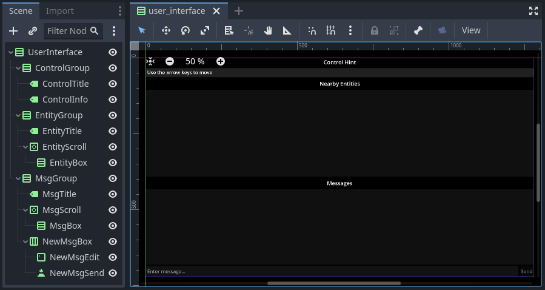
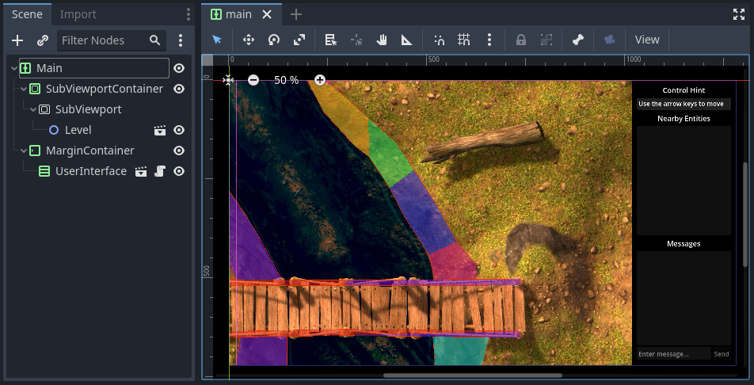

The User Interface
==================

In this section, we will set up the user interface and write a script that updates the user
interface based on the ``ChatPlayer`` node set up in the previous section. We'll also need to make
a new main scene to handle the connection between the level scene (already created) and the UI. By
the end of this section, we should be able to do the following from the user interface:

* See a constantly updated control hint message.
* See when other ``ChatEntity`` nodes are nearby.
* Write, send, and receive messages while in a conversation with another entity.

Part 1: The User Interface Scene
--------------------------------

Let's start by setting up the user interface scene along with its script.

Setting Up the Scene
^^^^^^^^^^^^^^^^^^^^

The user interface scene is provided premade here: :download:`user_interface.tscn`. Everything
should be set up except the scripts. Open up *user_interface.tscn*. You should see the following
scene (though the background may be a different color):

You will also need the files :download:`dynamic_label.tscn` and :download:`NewMsgEdit.cs`. The
first is a label scene that will be added from script during gameplay. The second is a short script
that makes it so that the enter key will send a message. Attach the *NewMsgEdit.cs* script now to
the ``NewMsgEdit`` node (this node is under the ``MsgGroup`` node).

Finally, if you want, you can change the project's default background color to black. This setting
can be found in the project settings under Rendering > Environment > Defaults > Default Clear
Color.

Writing the Script
^^^^^^^^^^^^^^^^^^

Now, we'll add the main script for interacting with the UI. It will be attached to the root node
of the scene (``UserInterface``) and will listen for signals from the ``ChatPlayer`` node and
update it when necessary.

Add a C# script to the UserInterface node. Save the script as "UserInterface.cs".

Properties
""""""""""

First, we'll add a property that will reference the ``ChatPlayer`` node attached to the
*seraphis.tscn* scene. We won't worry about setting it from inside the UI script and will instead
have it set by the main scene (up next).

.. code-block:: csharp

    // A reference to the ChatPlayer node (will be set by dependency injection via Main.cs)
    public ChatPlayer MyChatPlayer;

Next, we'll add properties that will hold references to the various child nodes of the
UI scene. This will make them easier to access from the code. (These will have values assigned to
them later in the ``_Ready()`` method.)

.. code-block:: csharp

    // Various nodes that will need to be updated during gameplay
    private Label _controlInfo;
    private VBoxContainer _entityBox;
    private ScrollContainer _msgScroll;
    private VBoxContainer _msgBox;
    private TextEdit _newMsgEdit;
    private Button _newMsgSend;

We'll also have a property that will reference the *dynamic_label.tscn* scene that we downloaded
earlier. This will be used to add labels dynamically for nearby entities and messages. Set the path
to point wherever you have this scene saved.

.. code-block:: csharp

    // Scenes that will need to be instanced during gameplay
    private PackedScene _dynamicLabelScene = GD.Load<PackedScene>("res://dynamic_label.tscn");

The last property that we'll have is a flag to indicate whether a new message has just been added
to the UI. This will be used to help us keep the messages' scroll container scrolled all the way to
the bottom so that the newest messages are always visible.

.. code-block:: csharp

    // Flag for when a message has been added to the message box and so we need to scroll to end
    private bool _msgBoxHasNewMsg = false;

Methods
"""""""

Now on to methods. First we'll override the node's ``_Ready()`` method. In this method, we'll
assign nodes to the properties declared earlier and we'll connect up a method to handle what
happens when the send button is pressed. We'll also call a helper function
``ConnectPlayerSignals()`` that connects all the relevant signals of ``ChatPlayer`` to methods in
this script.

.. code-block:: csharp

    // Called when the node enters the scene tree for the first time.
    public override void _Ready()
    {
        // Get all the various child nodes
        _controlInfo = GetNodeOrNull<Label>("ControlGroup/ControlInfo");
        _entityBox = GetNodeOrNull<VBoxContainer>("EntityGroup/EntityScroll/EntityBox");
        _msgScroll = GetNodeOrNull<ScrollContainer>("MsgGroup/MsgScroll");
        _msgBox = GetNodeOrNull<VBoxContainer>("MsgGroup/MsgScroll/MsgBox");
        _newMsgEdit = GetNodeOrNull<TextEdit>("MsgGroup/NewMsgBox/NewMsgEdit");
        _newMsgSend = GetNodeOrNull<Button>("MsgGroup/NewMsgBox/NewMsgSend");

        // Connect to the send message button (and propogate the signal)
        if (_newMsgSend != null)
            _newMsgSend.Pressed += OnNewMsgSendPressed;
        
        // Connect to the signals of the ChatPlayer
        CallDeferred("ConnectPlayerSignals");
    }

    // Connects to the various signals of the currently registered ChatPlayer
    private void ConnectPlayerSignals()
    {
        MyChatPlayer.ControlHintUpdated += SetControlHint;
        MyChatPlayer.ChatEntityAdded += AddEntity;
        MyChatPlayer.ChatEntityRemoved += RemoveEntity;
        MyChatPlayer.ConvoStarted += EnableNewMsg;
        MyChatPlayer.ConvoEnded += DisableNewMsg;
        MyChatPlayer.MsgAdded += AddMsg;
    }

.. note::

    In the ``_Ready()`` method, we use ``CallDeferred()`` to call ``ConnectPlayerSignals()`` so
    that we can be sure ``ChatPlayer`` has been loaded in the scene and ``MyChatPlayer`` has been
    set to reference it before we try to access it.

Next, we'll override the node's ``_Process()`` method. In this method, if a new message has just
arrived, we'll make sure the ScrollContainer is scrolled all the way to the bottom.

.. code-block:: csharp

    // Called every frame. 'delta' is the elapsed time since the previous frame.
    public override void _Process(double delta)
    {
        // Check if a new message has been added to the message box and scroll if needed
        if (_justAddedNewMsg)
        {
            _msgScroll.ScrollVertical = Mathf.RoundToInt(_msgScroll.GetVScrollBar().MaxValue);
            _justAddedNewMsg = false;
        }
    }

Next, write a method that handles setting the text of the "Control Hint" section.

.. code-block:: csharp

    // Set the text of the control hint label
    public void SetControlHint(string controlHint)
    {
        _controlInfo.Text = controlHint;
    }

Also, write the following methods for adding or removing an entity from the "Nearby Entities"
section. When adding an entity, we'll need to create a new instance of *dynamic_label.tscn* and add
it as a child in the appropriate place. When removing, we'll need to search through all the
labels and find the one that matches the entity we are trying to remove.

.. code-block:: csharp

    // Add a ChatEntity to the entity box
    public void AddEntity(ChatEntity newEntity)
    {
        // Add the new entity to the box
        Label newEntityLabel = _dynamicLabelScene.Instantiate<Label>();
        newEntityLabel.Text = newEntity.ChatName;
        _entityBox.AddChild(newEntityLabel);
    }

    // Remove a ChatEntity from the entity box
    public void RemoveEntity(ChatEntity oldEntity)
    {
        string entityString = oldEntity.ChatName;

        // Look through all the entities in the box
        foreach (Node child in _entityBox.GetChildren())
        {
            // If we find the entity, remove it and exit
            if (child is Label entityLabel && entityLabel.Text == entityString)
            {
                entityLabel.QueueFree();
                break;
            }
        }
    }

The next method will determine what happens when the send button is pressed (or when the enter key
is pressed). We just need to call the ``SendMsg()`` method of the ``ChatPlayer`` node.

.. code-block:: csharp

    // Called when the send button is pressed
    public void OnNewMsgSendPressed()
    {
        MyChatPlayer.SendMsg(_newMsgEdit.Text);
        _newMsgEdit.Text = "";
    }

The following two methods are for enabling and disabling text input and button presses in the UI.
They will be enabled when the player is in a conversation and disabled when they are not.

.. code-block:: csharp

    // Enable the controls for typing and sending a new message
    public void EnableNewMsg()
    {
        // Enable controls
        _newMsgEdit.Editable = true;
        _newMsgSend.Disabled = false;

        // Put focus on the text editor
        _newMsgEdit.GrabFocus();
    }

    // Disable the controls for typing and sending a new message
    public void DisableNewMsg()
    {
        // Disable controls
        _newMsgEdit.Editable = false;
        _newMsgSend.Disabled = true;

        // Release focus
        _newMsgEdit.ReleaseFocus();
        _newMsgSend.ReleaseFocus();
    }

The last method to write will allow us to add new chat messages to the UI. We'll need to create a
new instance of the *dynamic_label.tscn* scene and add it as a child in the appropriate place.
Also, we'll want to set ``_justAddedNewMsg`` flag to true so that it will scroll to the new
message.

.. code-block:: csharp

    // Add a ChatMsg to the message box
    public void AddMsg(ChatEntity sender, string msg)
    {
        // Add the new message to the box
        Label newMsgLabel = _dynamicLabelScene.Instantiate<Label>();
        newMsgLabel.Text = sender.ChatName + ": " + msg;
        _msgBox.AddChild(newMsgLabel);

        // Make sure we will scroll to the new message
        _justAddedNewMsg = true;
    }

Part 2: The Main Scene
----------------------

Now we will create the main scene where we can bring the level and the UI together.

Setting Up the Scene
^^^^^^^^^^^^^^^^^^^^

Create a new scene and add an ``HSplitContainer`` as the root node. Rename the node to ``Main`` and
save the scene. Using an ``HSplitContainer`` allows us to put the level on one side of the screen
and the UI on the other side and gives us a draggable border between them. Set the following
property so that the ``HSplitContainer`` takes up the whole screen:

* Control > Layout > Anhors Preset = "Full Rect"

Add a ``SubViewportContainer`` as a child of the ``Main`` node. Then add a ``SubViewport`` as a
child of the ``SubViewportContainer``. Set the following properties for the
``SubViewportContainer`` so that the level will expand to fill the left 80% of the screen by
default:

* SubViewportContainer > Stretch = On (checked)
* Control > Layout > Container Sizing > Horizontal = Expand (checked)
* Control > Layout > Container Sizing > Stretch Ratio = 4

Add a ``MarginContainer`` as a child of the ``Main`` node (below the ``SubViewportContainer``).
This is used to add a margin around the user interface so that it has some separation from the edge
of the window. Set the following properties:

* Control > Theme Overrides > Constants > Margin Top = 12
* Control > Theme Overrides > Constants > Margin Right = 12
* Control > Theme Overrides > Constants > Margin Bottom = 12

Also set the following properties on the ``MarginContainer`` so that the UI will expand to fill the
right 20% of the screen by default:

* Control > Layout > Container Sizing > Horizontal = Expand (checked)
* Control > Layout > Container Sizing > Stretch Ratio = 4

Finally, we can add the level and UI scenes. Instantiate ``level.tscn`` as a child of the
``SubViewport``, and instantiate ``user_interface.tscn`` as a child of the ``MarginContainer``. The
main scene should now look something like this:

Writing the Script
^^^^^^^^^^^^^^^^^^

If you remember, our UI script has a property that is meant to point to the ``ChatPlayer`` node.
Rather than having the UI script set that property itself, we'll have our ``Main`` node do so.

Add a C# script to the ``Main`` node. Save the script as *Main.cs*. In this script, we'll just need
to override the ``_Ready()`` method with the following code. This code searches in the
``SubViewport`` for a ``ChatPlayer`` node called "ChatPlayer". It then gets the UI node and sets
the ``MyChatPlayer`` property of the UI to point to the ``ChatPlayer`` node that was found.

.. code-block:: csharp

    // Called when the node enters the scene tree for the first time.
    public override void _Ready()
    {
        // Connect the UI up to the first ChatPlayer found
        ChatPlayer chatPlayer = GetNode("SubViewportContainer/SubViewport").FindChild("ChatPlayer") as ChatPlayer;
        UserInterface userInterface = GetNode<UserInterface>("MarginContainer/UserInterface");
        userInterface.MyChatPlayer = chatPlayer;
    }

Try It Out
^^^^^^^^^^

The main scene should now be ready to run! Press ``F5`` (or the "Run Project" button). When the
dialogue box asks you to select a main scene, click the "Select Current" button to select the
*main.tscn* scene.

.. note::

    You can also change the main scene in the project settings under Application > Run > Main
    Scene.

Confirm that you can still move Seraphis around as before. You should now also be able to see a
control hint message that changes based on the situation, you should see Gralk show up on the
"Nearby Entities" section, and you should be able to press SHIFT to start a conversation and ESC to
end a conversation with Gralk. Finally, you should be able to send messages to and receive messages
from Gralk via the UI.

.. image:: gameplay.gif
   :alt: Gameplay Example
   :width: 960px
   :align: center
