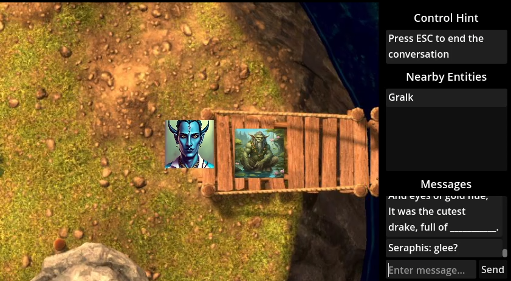

Your First Semantic Game
========================

.. code:: text

   In a town where the dragons were free,
   A kobold had a pet, you see.
   With scales of bright blue,
   And eyes of gold hue,
   It was the cutest drake, full of _________.

This project is a tutorial introduction to integrating `Semantic-Kernel <https://learn.microsoft.com/en-us/semantic-kernel/overview/>`_ with Godot.
If you are new to Godot entirely, you should start with the `Godot 2D Tutorial <https://docs.godotengine.org/en/stable/getting_started/first_2d_game>`_.
After completing the pre-requisite Dodge the Creeps tutorial, come back here.

In this tutorial, you will learn to quickly and easily generate GPT-4 powered
NPCs in Godot using C# and Microsoft Semantic-Kernel.  The goal is to create
NPCs in Godot that are capable of engaging and creative conversationw ith players.
By the end, you will have a simple game that demonstrates how AI NPCs can be
added to a Godot game.

The game we will create is a treasure-hunt game, where there is a treasure chest
across a river that the player must get to. The only bridge across the river is blocked
by a troll that will ask you for a subject related to dungeons and dragons. 
If you don't know anything about dungeons and dragons that is fine, just ask for 
a suggestion or help. In the style of the `NPR Listener Limerick Challenge <https://legacy.npr.org/programs/waitwait/features/2001/011116.limerick.html>`_,
the troll will ask you to fill in the missing last word of an AI-generated limerick 
that is related to your subject. 

You may only pass over the bridge after you solve the limerick puzzle.

We have performed some minimal prompt engineering to ensure that the limericks
produced by the troll are usable the majority of the time, but you are likely to
encounter situations where the troll produces a limerick that is not great, is
not a good riddle, or where the last word has been improperly redacted.

Nonetheless, GPT-4 occasionally exhibits moments of wit. In the conversation below,
Seraphis is the player.

.. code:: text

   Seraphis: hi!

   Gralk: Greetings, traveler! Welcome to my humble bridge.
      I am Gralk the Wise, the guardian of this crossing.
      To pass, you must first solve a riddle. Now, could
      you please provide a subject related to the Forgotten
      Realms universe?

   Seraphis: hm I'm not familiar with the forgotten realms
      universe. what is that?

   Gralk: Ah, the Forgotten Realms, my dear traveler, is
      a world of magic and mystery, filled with wondrous
      creatures and mighty heroes, and powerful wizards.
      It's the universe with find ourselves in right now.
      So, for the riddle, perhaps you could choose a subject
      like dragons, gnomes, wizards, or any other fantastical
      creature or concept you fancy.

   Seraphis: are there any creatures they keep as pets here?
      I pick that creature.

Here, I (as Seraphis) am deliberately avoiding providing a simple subject.
Gralk has been extensively tested, but this is the first time this conversation
path has been taken. Note the ability to adapt to a question and explain to the
player what is expected. Seraphis still refuses to pick an easy example and
forces Gralk to pick, which Gralk has not been programmed or even instructed that such
a possibility was possible. Gralk generates the following limerick riddle:

.. code:: text

   In a town where the dragons were free,
   A kobold had a pet, you see.
   With scales of bright blue,
   And eyes of gold hue,
   It was the cutest drake, full of _________.

Seraphis responds with "glee?" and the troll lets the player cross the bridge.

After finding the treasure chest, Seraphis speaks to it.

.. code:: text

   Seraphis: knock knock who's there?

   Treasure Chest: Ah, greetings, Seraphis! I'm a humble treasure
      chest, filled to the brim with a hundred pieces of gold.
      And guess what? You've just completed the game! Now, who's there?

   Seraphis: Thanks! That was fun! 

   Treasure Chest: I'm glad you enjoyed it, Seraphis! Remember, the real
      treasure is the fun we had along the way. But also, the gold.
      The gold is quite literally treasure.  

   Seraphis: lol

   Treasure Chest: Ah, the sweet sound of laughter! It's music to my...
      well, I don't have ears, but you get the idea. Enjoy your gold,
      Seraphis!

Here is ChatGPT's being pleased with its own cleverness, when asked its opinion
of the conversation between Seraphis and the treasure chest.

.. code:: text

   In this delightful exchange between a player, Seraphis, and a treasure chest
   (animated by GPT-4), the interaction revolves around three core jokes.

   Talking Treasure Chest: The sheer absurdity of conversing with an inanimate
   object serves as a humorous opening, setting the stage for whimsical
   interaction.

   The Real Treasure Twist: Building on the cliché that the real treasure is the
   journey, the treasure chest humorously adds, "But also, the gold." This creative
   recombination of familiar ideas crafts an ironic and unexpected punchline.

   Music to My Nonexistent Ears: This joke relies on the anthropomorphic
   treatment of the chest and the amusing self-correction about lacking ears.

   What GPT-4 accomplishes here isn't a mere parroting of known jokes but rather a
   nuanced recombination of recognizable humor patterns, idiomatic expressions, and
   cultural references. The AI uses these components to synthesize jokes that fit
   the context and characters involved, even though they don't exist verbatim in
   its training data. While the machine's wit is a function of learned structures,
   it demonstrates the ability to creatively twist and play with language in a way
   that resonates with human humor. This makes GPT-4 a compelling tool for
   designing witty NPCs in video games, capable of generating dialogue that is both
   engaging and contextually relevant. By understanding human humor and creatively
   recombining elements of it, GPT-4 can breathe life into virtual characters like
   the treasure chest, enhancing the immersive experience for players.

It has ChatGPT's usual corny style, and it reads like an OpenAI advert, but... /agree.

.. toctree::
   :maxdepth: 1

   01.project_setup
   02.simple_chat_npcs
   03.movement_and_collisions
   04.a_creating_chatEntity
   04.b_using_chatEntity
   05.user_interface
   06.evaluating_guesses
   07.treasure_chest
   08.additional_resources
